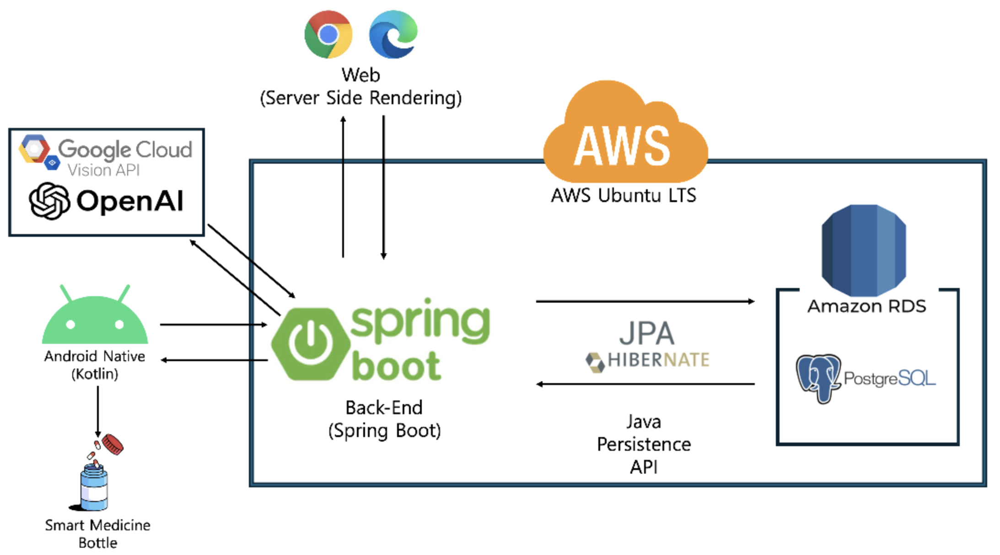

# promise
## Product

**-스마트 약통과 모바일 애플리케이션을 통한 만성 질환자들의 자동 복약관리 서비스**

**-질병 정보 공유를 위한 웹 커뮤니티 서비스**

---

## Members & Role

| 이름   | 역할             |
| ------ | ---------------- |
| 이승욱 | Back-End, DevOps |
| 곽덕연 | H/W 제품 개발    |
| 신은빈 | Front-End        |
| 김동현 | CAD, 제품 디자인 |
| 김정훈 | H/W 로직 개발    |
| 노예진 | User Interface   |

---

## Architecture

